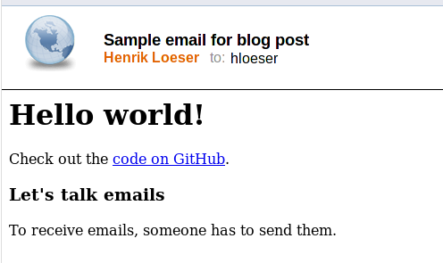

# Send emails using IBM Cloud Functions
Use a simple IBM Cloud Functions action to send out emails via SMTP. Pass in the SMTP server configuration and the email using JSON objects. 
For ease of use, bind the server configuration to the action and only pass in the email to send.

The following screenshot shows an email based on [this sample properties](email.blog.json).



## Deploy

Use the IBM Cloud CLI and the Cloud Functions plugin to deploy the action. Log in to IBM Cloud, set the namespace and then run:

```sh
ibmcloud fn deploy -m Cloudmailer.yaml
```

Copy over [smtp_config.sample.json](smtp_config.sample.json) to, e.g., **smtp_config.sendgrid.json**. Then adapt the file and use it to set the SMTP configuration as default:

```sh
ibmcloud fn action update cloudmailer/sendEmail   -P smtp_config.sendgrid.json
```

Be aware that typically the port 25 is blocked. Many email providers are using ports like 465 or 587.

## Send emails

To send an email, invoke the action and pass in the JSON object with the email properties. Use [email.sample.json](email.sample.json) and copy it over to a new file, e.g., [email.blog.json](email.blog.json). Edit it to your needs like shown. The email can include plain text in the **text** property, an HTML version in the **html** property or both.


### Send emails using the CLI

Once you or your app have composed an email object, send the email by [invoking the action](https://cloud.ibm.com/docs/openwhisk?topic=cloud-functions-cli-plugin-functions-cli#cli_action_invoke) using the IBM Cloud CLI:

```sh
ibmcloud fn action invoke cloudmailer/sendEmail -r  -P email.json 
```

To send out an email using another SMTP server configuration, you can pass in both the server config and the email properties:
```sh
ibmcloud fn action invoke cloudmailer/sendEmail -r  -P email.json -P smtp_config.myserver.json
```

### Send emails using the API

You can [invoke the sendMail action via API](https://cloud.ibm.com/apidocs/functions#invokeaction). For testing, use the tool **curl**. See the documentation for sample code in some programming languages. Calling an API function requires a valid IBM Cloud IAM access token. In the following example, we first obtain the token and assign its value to an environment variable. Thereafter, we use the token for a curl to send a POST request to invoke the action. The email properties are passed in from a file.

```
export TOKEN=$(ibmcloud iam oauth-tokens --output json | jq -r .iam_token)

curl -X POST --url 'https://us-south.functions.cloud.ibm.com/api/v1/namespaces/04a49bd4-xxxx-xxxx-xxxx-07be0c9b732b/actions/cloudmailer/sendEmail?blocking=true&result=true' -H 'Accept: application/json' -H "Authorization: $TOKEN"  -H 'content-type: application/json' -d @email.json
```
### Expose the sendMail action as web action

Another option is to turn the action into a web action. See the [IBM Cloud Functions documentation on web actions](https://cloud.ibm.com/docs/openwhisk?topic=openwhisk-actions_web) for details.

## SMTP server configuration
Some notes on common scenarios.

### Use with your custom domain and SMTP server

SMTP / email setup differs depending on your provider. If your provider allows API keys instead of username / password, go with API keys. You may also create a dedicated email account to send out emails. The typical structure for your smtp_config.json looks like this:

```
{
    "server": {
        "host": "smtp.example.com",
        "port" : 465,
        "id": "yourname@example.com",
        "password": "your-password"
    }
}
```


### Use with SendGrid

[IBM Cloud integrates with SendGrid for email delivery](https://cloud.ibm.com/catalog/infrastructure/email-delivery). You can sign up for SendGrid, then use its [SMTP service](https://sendgrid.com/docs/for-developers/sending-email/getting-started-smtp/) with the action from this repository. See the SendGrid documentation or the [IBM Cloud Email Delivery](https://cloud.ibm.com/docs/email-delivery?topic=email-delivery-about-email-delivery) documentation for details.

To send emails, create an API key with at least **Mail Send** privileges. The SMTP configuration, e.g., **smtp_config.sendgrid.json** would then look similar to this:
```
{
    "server": {
        "host": "smtp.sendgrid.net",
        "port" : 465,
        "id": "apikey",
        "password": "your-api-key"
    }
}
```